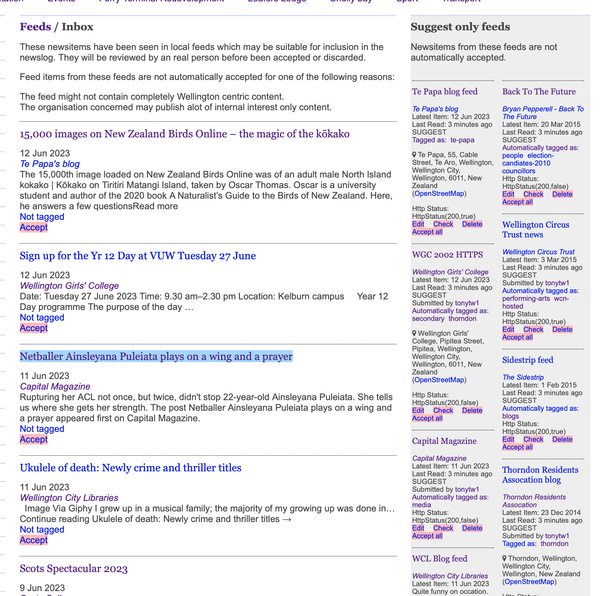

# wellynews

Aggregates community news items and RSS feeds from my hometown Wellington, New Zealand into a newslog
(see https://wellington.gen.nz and [@wellynews](https://twitter.com/wellynews)).


The content is automatically categorised and can be output as customised RSS feeds.

For example:
- [Transport related newsitems](https://wellington.gen.nz/transport) (a tag feed)
- [Consultation about the Central Library](https://wellington.gen.nz/consultation+central-library) (a tag combiner feed)
- Newsitems published by [Wellington City Council about the draft spatial plan](https://wellington.gen.nz/wellington-city-council+draft-spatial-plan) (a publisher tag combiner feed).

This a long running project (> 15 years of continuous operation) and the code base has changed alot over the years.

Currently implemented as Scala controllers served from Spring Boot.
MongoDB is used for persistence and Elasticsearch for indexing.


## Related services

Specific concerns have been pushed into these potentially reusable services:

- [Whakaoko](https://github.com/tonytw1/whakaoko) for RSS feed polling and aggregation.
- [Cards](https://github.com/tonytw1/cards) for decorating news items with social media images.
- [Nominatim AC](https://github.com/tonytw1/nominatim-ac/) for OpenStreetName place name lookups.
- [RSS to Twitter](https://github.com/tonytw1/rsstotwitter) for automatic publishing to Mastodon and Twitter.

## Model

### Website

The website of a content publisher such as Wellington City Council.  
Newsitems and feeds found on this website will be attributed to this publisher.


### Feed

An RSS feed published by a website.
News items accepted from this feed will be attributed to this feed.


### Newsitem

A news item published on a publisher's website.

A page with a unique URL containing a press release or a match report.


### Watchlist

A page on a publishers website which is known to contain links to new news items.
This might be a homepage or a news page.

Watchlist is used when a publisher with interesting content does not provide a feed 
but their content is valuable enough to post manually.

Watchlist items are polled regularly to detect updates;
see detecting page changes (below)[(#detecting-changes)].


### Tag

Tags are used to categorise content into use ful categories (like consultation and transport).
Tags can be applied to content types.

Tags can be arranged into a hierarchy which effects where tagged content appears.

ie. Trains is a child of Transport.

News items about trains are included in the transport tag's news items.


### Hand tagging

Different people (or systems) may have different opinions about what tags should be applied to an item.

A hand tagging records that a user thinks a tag should be applied to a content item.

These taggings contribution to the items actual tagging (see Tagging votes below).


## Tagging votes

Been able to automatically arrange news items into meaningful categories like consultation and transport is something we really wanted.
We can infer alot about a news item by considering where it came from and who published it.

These signals are combined in a tagging vote to determine a news items visible tags.

ie. This example news item talks about an exhibition at a cafe in Newtown.


The tagging votes show how we arrived at this set of tags.


- We know which suburb it's in because the publisher is tagged with Newtown.
- We have a geotagged location because the publisher has a geotag.
- We know it's about an exhibition because it was accepted a feed tagged exhibition.
- We know it's about art because exhibitions is a child ot art.


### Index tags

Index tags determine which tags give resources appear under.
For example an item tagged trains will also appear under transport.
Some slightly interesting things happen to automatically calculate the index tags

We can infer alot about an item's tags from what we know about where it came from.


##### Hand tagging

Represents a tag applied directly by a user.

##### Publisher tags

News items inherit tags from their publisher.
For well categorised publishers such as transport operators or sports clubs this approach can tag their newsitems with a high level of confidence.

##### Feed tags

News items accepted from a feed inherit the hand taggings applied to the feed.

Some publishers has multiple feeds which each cover a very specific topic (such as the city council's planning applications).
In this case a feed tagging  very accurately tag the newsitems from that feed.

##### Ancestor tags

Includes the ancestors of applied tags.
Been tagged as Trains implies that this newsitem is related to Transport.

##### Geotag votes

Votes which contribute to the visible location of a newsitem. Could be an explicit geocode of could be inferred from the
news items tags or publisher


### Autotagging

When newsitem text matches keywords associated with specific tags we apply an autotagging.
This is represented as a hand tagging applied by the autotagger user.


#### RSS feed item categories

If an RSS feed item contains RSS `category` tags, the autotagger wil try to match the values of these category tags
to tag autotag hints.

An item with a category of 'events' will be matched to the tag Events.


### Detecting changes

Changes in pages can be detected by periodically downloading and checking them.
Changes in content checksums indicate potential new content.

Pages often contain elements such as timestamps which make page's checksum unstable even if contains no new content.
Only comparing the plain text content of a page helps to reduce these false positives.


## Feed reading

Most news items are accepted from publisher's RSS feeds. Feed reading is the process of periodically polling these feeds 
and deciding which items to accept and distribute.


### Feed acceptance policy

Each publisher feed is assigned a feed acceptance policy which describes how we should treat feed items in that particular feed.

Most feeds always contain relevant and appropriate content which can be automatically accepted; some don't.
The feed acceptance policy helps document which feeds require manual moderation.

`ACCEPT`
A trusted source of relevant content. All items can be automatically accepted.

`ACCEPT_EVEN_WITHOUT_DATES`
Accept even without dates

`ACCEPT_IGNORING_DATE`
Accept ignoring date

Trusted sources with good content but questionable publication dates.
These feed items can be automatically accepted we'll ignore the publication date.

`SUGGEST`

Feeds with a mix of relevant and irrelevant content. New feeds items should be suggested for manual moderation.
The contents of suggested feeds appear on the feeds inbox screeb (below).

`IGNORE`

Feeds with no relevant content at the moment. Ignore the contents of these feeds.


### Accepted feed items view

Shows the news items which have been accepted from feeds on a particular day.
This is useful for moderation and discovering items which could benefit from having additional tags applied.


### Feeds inbox

The feeds inbox shows the feed items currently available in suggested feeds.

If a feed contains a mix of relevant and irrelevant items, we can't automatically accept all items from it.

The feeds inbox screen is used to quickly scan the feed items available in the feeds with a suggest acceptance policy.

Relevant items which can be manually accepted using the accept action.




### Social media Cards / Open Graph images

News items are decorated with Twitter Cards and Open Graph social media images
using the [Cards service](https://github.com/tonytw1/cards).

We try to detect and filter out images which are a publisher's generic filler images.

ie.
This generic logo should not be included but a article specific images should be.


### Admin actions

#### Backfill new tag

The autotag prompt allows a new tag to be backfilled with existing news items which match the new 
tag's autotagging rules.

#### Gather publisher resources

Given a publisher find unassigned newsitems and feeds which probably belong to this publisher.

This decision is based on url hostnames.


## Local dev

Use docker to provide local copies of the MongoDB, Elasticsearch, Memcached andRabbitMQ dependencies.

```
docker compose -f docker/docker-compose.yml up
```

Start locally.
```
mvn spring-boot:run
```

## Cloud build

```
gcloud components install cloud-build-local
cloud-build-local --config=cloudbuild.yaml --dryrun=false --push=false .
```
